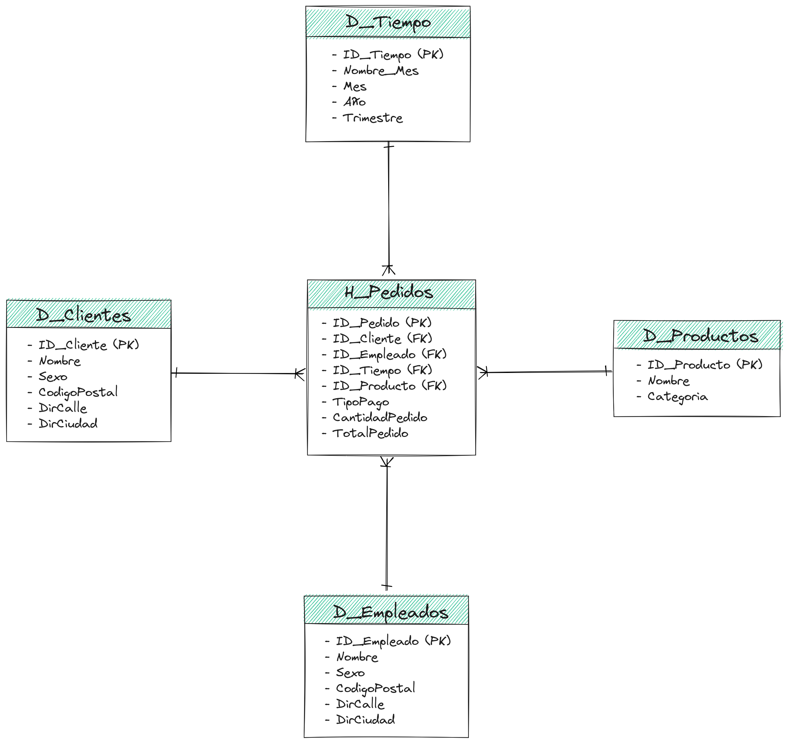
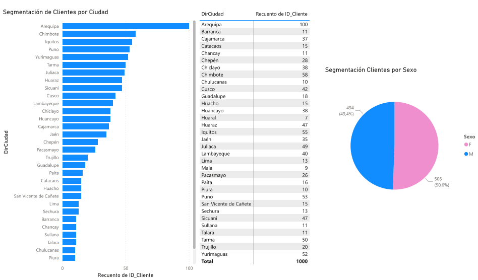
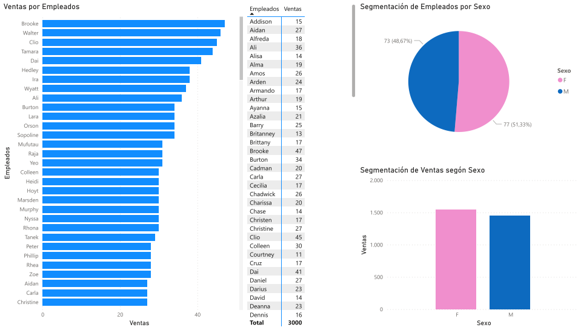
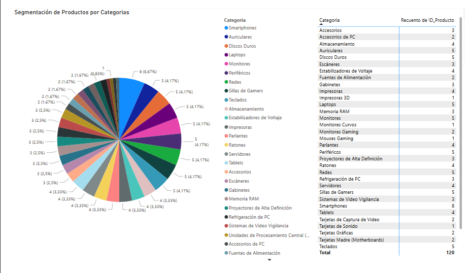
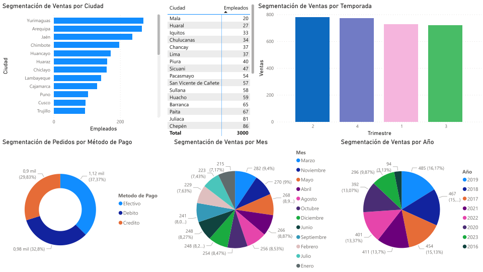

# Sistema Gestor de Ventas

## Tabla de Contenido

0. [Antes de Continuar](#0-antes-de-continuar)
1. [Introducción](#1-introducción)
   1. [Problemática](#11-problemática)
   2. [Solución](#12-solución)
2. [Modelado de Datos](#2-modelado-de-datos)
   1. [Análisis de Requerimientos](#21-análisis-de-requerimientos)
   2. [Modelo Entidad Relación](#22-modelo-entidad-relación)
   3. [Normalización](#23-normalización)
   4. [Modelo Relacional](#24-modelo-relacional)
3. [Explotación de Datos y Data Warehouse](#3-explotación-de-datos-y-data-warehouse)
   1. [Propósito del Data Warehouse](#31-propósito-del-data-warehouse)
   2. [Requerimientos](#32-requerimientos)
   3. [Modelo de Datos](#33-modelo-de-datos)
   4. [Proceso ETL](#34-proceso-etl)
4. [OLAP (Procesamiento Analítico en Línea)](#4-olap-procesamiento-analítico-en-línea)
5. [Power BI (Business Intelligence)](#5-power-bi-business-intelligence)

## 0. Antes de Continuar

Antes de avanzar, es crucial entender la estructura del repositorio.

### Estructura de Carpetas

- **/img:** Contiene las imágenes utilizadas en la documentación.

- **/instalacion:** Documentación relacionada con la instalación del sistema.

- **/proyecto:**
  - **/databases:** Archivos relacionados con la base de datos.
  - **/ETL:** Archivos relacionados con el Proceso ETL.
  - **/OLAP:** Archivos relacionados con el Procesamiento Analítico en Línea (OLAP).
  - **/PowerBI:** Archivos y documentos relacionados con la implementación de Power BI.

- **/teoria:** Contiene documentos y recursos relacionados con la teoría del sistema.

- **README.md:** Archivo principal que proporciona una visión general del repositorio y enlaces a la documentación relevante en las carpetas.

```plaintext
Importante!

Este documento proporciona información sobre el proyecto. Si deseas acceder a detalles sobre los procesos (Base de Datos, ETL, OLAP, PowerBI), sigue los pasos a continuación:

1. Instalación: Antes de comenzar, instala las herramientas necesarias siguiendo el paso a paso que se encuentra en el directorio: [/instalacion].

2. Después de completar las instalaciones, puedes ver al paso a paso del proceso en el directorio de [./teoria] o acceder al proyecto ya finalizado en el siguiente directorio: [./proyecto].

3. Luego continua leyendo esta documentacion.
```

### POBLAR LA BASE DE DATOS

Puedes poblar la base de datos utilizando las siguientes páginas:

1. [generatedata.com](https://generatedata.com/)
2. [faker.readthedocs.io](https://faker.readthedocs.io/en/master/)
3. [github.com/fzaninotto/Faker](https://github.com/fzaninotto/Faker)
4. [techtarget.com](https://www.techtarget.com/searchcio/definition/synthetic-data)
5. [mockaroo.com](https://mockaroo.com/)

## 1. Introducción

Este documento detalla la propuesta para el desarrollo de un Sistema de Gestión de Ventas respaldado por una base de datos relacional, Microsoft SQL Server 2019, y potenciado por la herramienta de visualización PowerBI.

### 1.1 Problemática

En muchas empresas, especialmente aquellas dedicadas a la venta de productos, la gestión manual de ventas y clientes puede resultar ineficiente y propensa a errores. Los métodos tradicionales de seguimiento en papel o en hojas de cálculo dificultan el acceso y la toma de decisiones informadas. Esta problemática puede manifestarse de diversas maneras:

- **Desorganización de la Información:** Datos dispersos dificultan la búsqueda y recuperación rápida de información.
- **Errores y Fallos en el Seguimiento:** Errores manuales pueden resultar en información incorrecta y desactualizada.
- **Dificultad en el Análisis:** La falta de herramientas adecuadas dificulta la generación de informes precisos.
- **Retrasos en la Toma de Decisiones:** La falta de acceso oportuno a datos relevantes puede dificultar la toma de decisiones informadas.

### 1.2 Solución

La solución propuesta consiste en el diseño e implementación de un Sistema Gestor de Ventas respaldado por una base de datos relacional en SQL Server. Esta solución automatizará y optimizará la gestión de ventas y clientes, permitiendo un seguimiento preciso y en tiempo real de las transacciones, inventarios y análisis de rendimiento. La integración de PowerBI potenciará la visualización de datos, facilitando la generación de informes interactivos y visuales.

## 2. Modelado de datos

### 2.1 Análisis de Requerimientos

En esta sección, exploraremos los requisitos esenciales para el diseño de la base de datos del sistema de gestión de ventas.

#### Clientes

- Registrar información personal de los clientes, como nombre, dirección y contacto.
- Almacenar historial de compras y preferencias para estrategias de marketing personalizadas.

#### Pedidos

- Capturar detalles de los pedidos, incluyendo producto, vendedor, fecha, estado y total.

#### Detalles de Pedidos

- Registrar productos individuales asociados a cada pedido.
- Almacenar cantidad y total de cada producto en el pedido.

#### Métodos de Pago

- Mantener información sobre diferentes métodos de pago aceptados.

#### Productos

- Registrar detalles de productos como nombre, descripción y precio.
- Mantener un registro de inventario para controlar la disponibilidad.

#### Categoría de Productos

- Organizar productos en categorías para facilitar la navegación y búsqueda.

#### Empleados

- Registrar detalles personales y laborales de los empleados.

#### Proveedores

- Registrar detalles de los proveedores, incluyendo información de contacto y productos o servicios suministrados.

### 2.2 Modelo Entidad Relacion

En la siguiente sección, se presentará un modelo E-R desarrollado para el sistema de gestión de ventas, teniendo en cuenta las entidades y relaciones definidas.


A continuacion se describen las relaciones entre las entidades:

- Un Cliente puede realizar varios Pedidos. (1:N)
- Un Pedido pertenece a un Cliente. (N:1)
- Un Pedido contiene muchos Productos (N:M).
- Un Producto puede tener muchos Pedidos (N:M).
- Un Pedido es atendido por un Empleado. (N:1)
- Un Producto o más son suministrados por un Proveedor. (N:1)

### 2.3 Normalización

La normalización es un proceso esencial en el diseño de la base de datos que ayuda a organizar la información de manera eficiente y reducir redundancias. En este contexto, se aplicará la normalización a las tablas del sistema de gestión de ventas para asegurar que estén en conformidad con las formas normales estándar. Este proceso mejora la integridad de los datos y facilita la administración de la base de datos a medida que evoluciona con el tiempo.

**Nota:** Cabe aclarar que, en algunas instancias, se optó por aplicar el proceso de desnormalización. Este enfoque implica la introducción controlada de redundancias, considerando que podría resultar más eficiente y, en ciertos casos, innecesario aplicar todas las formas normales a todas las tablas. La decisión de desnormalizar se tomó cuidadosamente, evaluando el equilibrio entre eficiencia y la necesidad específica de cada tabla en el contexto del sistema de gestión de ventas.

A continuación se presentaran las entidades ya normalizadas:


### 2.4 Modelo Relacional

Para representar el sistema de gestión de ventas a nivel de base de datos, se presenta a continuación un modelo relacional que define las tablas y las relaciones entre ellas. Este modelo ayuda a visualizar cómo las entidades identificadas en el modelo E-R ya Normalizadas se traducen en tablas con columnas y relaciones en una base de datos relacional.


Gracias por proporcionar la información detallada para la sección 3. A continuación, te presento la redacción para esa sección:

## 3. EXPLOTACIÓN DE DATOS Y DATA WAREHOUSE

En esta sección, exploraremos cómo aprovecharemos los datos actualmente almacenados en nuestra base de datos para impulsar un análisis más profundo y la creación de informes que generen un impacto significativo. A través de la implementación de un Data Warehouse, desbloquearemos el potencial de nuestros datos, lo que nos ayudará a tomar decisiones más inteligentes y estratégicas.

### 3.1 PROPÓSITO DEL DATA WAREHOUSE

El propósito de nuestro Data Warehouse es mejorar la toma de decisiones y la eficiencia operativa de nuestra empresa. Esto incluye la optimización de la gestión de ventas, la identificación de oportunidades de crecimiento y la mejora de la satisfacción del cliente.

### 3.2 REQUERIMIENTOS

Antes de comenzar con el diseño del modelo de datos, es crucial comprender los requisitos del sistema. Estos requisitos guiarán la identificación de entidades, relaciones y atributos necesarios para construir una base de datos que cumpla con las necesidades de la empresa.

1. **Clasificación de los Productos (Categoría)**
   Utiliza la entidad "Producto" en tu base de datos para obtener información sobre los productos, incluyendo la clasificación o familia a la que pertenecen. Puedes agrupar los productos por su clasificación y calcular métricas relevantes, como las ventas totales por familia.

2. **Segmentación de Clientes**
   * 2.1 *Por ubicación*: Utiliza la entidad "Clientes" para obtener información sobre la ubicación de los clientes, como región, provincia, comuna o sucursal. Puedes crear informes que muestren la distribución de los clientes en función de estas ubicaciones.
   * 2.2 *Por Sexo*: Relaciona esta información con las compras de productos para identificar qué tipo de productos prefieren los clientes según su sexo.

3. **Ventas Mensuales**
   Utiliza la entidad "Pedidos" para obtener datos de ventas, incluyendo fechas de pedidos. Puedes crear informes que resuman las ventas mensuales y anuales, calculando los ingresos totales en cada período.

4. **Ventas Anuales**
   Utiliza la entidad "Pedidos" para obtener datos de ventas, incluyendo fechas de pedidos. Puedes crear informes que resuman las ventas anuales, calculando los ingresos totales en cada período.

5. **Tendencias de Ventas por Temporada**
   Analiza las tendencias de ventas a lo largo del año para identificar estacionalidades. Esto puede ayudarte a planificar inventario y promociones de manera más efectiva.

6. **Determinar en qué zonas se venden más**
   Al llevar a cabo un análisis de ventas basado en datos geográficos, podrás identificar las zonas donde se venden más productos. Esto te ayudará a tomar decisiones estratégicas, como dirigir tus esfuerzos de marketing hacia esas áreas.

7. **Análisis de Ventas por Tipo de Pago**
   Utiliza el atributo "Tipo_Pago" para realizar un análisis de las ventas en función de los métodos de pago utilizados por los clientes. Crea informes que muestren cómo varían las ventas según el tipo de pago y analiza la preferencia de pago de los clientes.

8. **Segmentación de Empleados**
   * 8.1 *Por Sexo*: Utiliza el atributo "Sexo" de los empleados para segmentar a los clientes en función del género del empleado que los atiende. Analiza si existe alguna correlación entre el género del empleado y las preferencias de compra de los clientes.
   * 8.2 *Por Venta*: Utiliza la información de ventas asociada a cada empleado para analizar el desempeño de ventas de cada miembro del equipo. Crea informes que muestren las ventas totales generadas por cada empleado y analiza las diferencias de rendimiento.
   * 8.3 *Sexo más vende*: Utiliza la información de ventas asociada a cada empleado para analizar el desempeño de ventas de cada miembro del equipo según su sexo. Crea informes que muestren las ventas totales generadas por cada empleado según sexo y analiza las diferencias de rendimiento.

**¡PREGUNTA!**
¿Realmente como dueño de una empresa me sirve analizar las ventas por tipo de pago? ¿Por qué yo como dueño de una empresa solo me interesa que me paguen, esto para que sirve? Hablando hipotéticamente.
- **Optimización de Operaciones:** Aunque tu objetivo principal sea recibir el pago, el tipo de pago puede tener un impacto en las operaciones. Por ejemplo, las transacciones en efectivo pueden requerir más tiempo y recursos de manejo en comparación con las transacciones con tarjeta de crédito. Analizar los tipos de pago puede ayudarte a optimizar tus operaciones y reducir costos.
- **Mejora de la Experiencia del Cliente:** La elección del tipo de pago puede influir en la experiencia del cliente. Al entender las preferencias de pago de tus clientes, puedes adaptar tus opciones de pago para satisfacer sus necesidades y mejorar la satisfacción del cliente.

### 3.3 MODELO DE DATOS

En esta sección, presentaremos el modelo de datos que se implementará en nuestro Data Warehouse. Este modelo permitirá un análisis multidimensional, proporcionando una visión más profunda y significativa de nuestra información. Las tablas clave en nuestro modelo incluyen una tabla de hechos, denominada **H_Pedidos**, y tablas de dimensiones que son esenciales para contextualizar y enriquecer los datos en nuestra tabla de hechos. Las tablas de dimensiones que utilizaremos son **D_Clientes**, **D_Empleados**, **D_Productos**, y **D_Tiempo**.

#### Tabla de Hechos: H_Pedidos

La tabla de hechos, **H_Pedidos**, actúa como el núcleo central de nuestro modelo. Contendrá las métricas clave y las medidas cuantificables sobre las transacciones de ventas.
Esta tabla nos permitirá realizar análisis sobre las ventas desde diversas perspectivas, como la temporalidad, los clientes, los productos y los empleados.

#### Tablas de Dimensiones

**D_Clientes:** Esta tabla de dimensión contendrá información detallada sobre nuestros clientes, Al relacionar esta tabla con la tabla de hechos, podemos analizar las ventas desde la perspectiva del cliente y entender mejor su comportamiento de compra.

**D_Empleados:** La tabla de dimensión para empleados proporcionará detalles sobre nuestro equipo de ventas, incluyendo nombre, información de contacto, y cualquier otra información laboral relevante. Relacionando esta tabla con la tabla de hechos, podremos evaluar el desempeño individual de los empleados y su contribución a las ventas.

**D_Productos:** Contendrá información detallada sobre los productos que ofrecemos. Al vincular esta tabla con la tabla de hechos, podemos analizar las ventas desde la perspectiva de productos específicos, identificando qué productos son más populares o generan mayores ingresos.

**D_Tiempo:** La dimensión del tiempo nos permitirá realizar análisis temporales de nuestras ventas. Con esta información, podemos explorar tendencias estacionales, identificar patrones de compra en días específicos y evaluar el rendimiento a lo largo del tiempo.

Este modelo de datos proporcionará una base sólida para el análisis multidimensional, permitiéndonos obtener información valiosa sobre nuestras operaciones de ventas y clientes.



### 3.4 PROCESO ETL

El proceso ETL (Extracción, Transformación y Carga) es fundamental en la creación de un Data Warehouse, y una parte importante de ese proceso involucra la creación de tablas de hechos y dimensiones. Aquí está cómo se relaciona el proceso ETL con la estructura de tablas de hechos y dimensiones en un Data Warehouse.

**EXTRACCIÓN (Extract)**
En esta etapa, los datos se extraen de fuentes diversas, en este caso desde una BD llamada ‘Sistema de Gestión de Ventas’. Estos datos se recopilan y se transforman en un formato adecuado para su posterior análisis. Durante esta fase, se pueden extraer datos de las entidades relevantes de la base de datos operativa, como Clientes, Pedidos, Productos y Empleados que son relevantes, ya que contienen información crítica para comprender las ventas, la satisfacción del cliente y la gestión de empleados.

**TRANSFORMACIÓN (Transform)**
Aquí es donde se realizan las transformaciones necesarias en los datos para que sean aptos para el análisis. Durante esta fase, los datos extraídos se limpian, se filtran y se estructuran según los requisitos del Data Warehouse.

**CARGA (Load)**
En la última etapa del proceso ETL, los datos transformados se cargan en el Data Warehouse. Se crean tablas de hechos y dimensiones que servirán como base para el análisis de datos. Estas tablas están diseñadas para facilitar consultas complejas y proporcionar una visión integral de la información almacenada.

Este proceso garantiza que los datos estén listos para ser explorados y analizados de manera efectiva, permitiendo a los usuarios realizar consultas y generar informes que respalden la toma de decisiones estratégicas.

### 4. OLAP (Procesamiento Analítico en Línea)

La implementación de OLAP (Procesamiento Analítico en Línea) en nuestro entorno de Sistema de Gestión de Ventas se convierte en un paso crucial después de completar las fases de Requerimientos, Modelado de Datos y el Proceso ETL. A continuación, se destacan las razones fundamentales para adoptar OLAP en nuestra arquitectura analítica:

#### Mejora del Análisis Multidimensional
Con la fase de Modelado de Datos, hemos estructurado nuestra base de datos para admitir un análisis multidimensional. El Cubo OLAP nos proporciona una interfaz eficiente para explorar y analizar datos desde múltiples dimensiones, como clientes, productos, ubicaciones y tiempo. Esto facilita la identificación de patrones, tendencias y relaciones en los datos de ventas.

#### Cumplimiento de Requerimientos Específicos
Durante la fase de Requerimientos, identificamos necesidades analíticas específicas, como la clasificación de productos, la segmentación de clientes y análisis de ventas por diversos criterios. OLAP nos permite cumplir con estos requisitos proporcionando una estructura que organiza los datos de manera óptima para análisis detallados y consultas interactivas.

#### Facilitación de Consultas Complejas
El Proceso ETL nos ha brindado un Data Warehouse consolidado y optimizado para consultas analíticas. La implementación de OLAP lleva esta eficiencia un paso más allá al proporcionar un mecanismo que facilita consultas complejas y sofisticadas. Los usuarios pueden realizar análisis ad hoc y explorar libremente los datos sin comprometer el rendimiento del sistema.

#### Generación de Informes Avanzados
Con OLAP, estamos mejor posicionados para generar informes avanzados y paneles de control. Podemos crear visualizaciones dinámicas que ofrecen a los usuarios una representación clara y detallada de los datos, lo que facilita la toma de decisiones informadas y estratégicas.

#### Potencial para Análisis Predictivo
El análisis predictivo, como identificar tendencias futuras o prever la demanda, se vuelve más accesible con la implementación de OLAP. La capacidad de explorar datos desde diversas dimensiones y realizar análisis comparativos facilita la identificación de patrones que pueden guiar estrategias futuras.

### 5. Power BI (Business Intelligence)

Con el desarrollo exitoso de las fases anteriores, llegamos al paso final de nuestra arquitectura analítica: la implementación de Power BI. Con la información estructurada en nuestro Data Warehouse y enriquecida por las capacidades OLAP, Power BI nos permite presentar datos de manera visual e intuitiva. Los gráficos, tablas y paneles interactivos facilitan la comprensión de la información.





