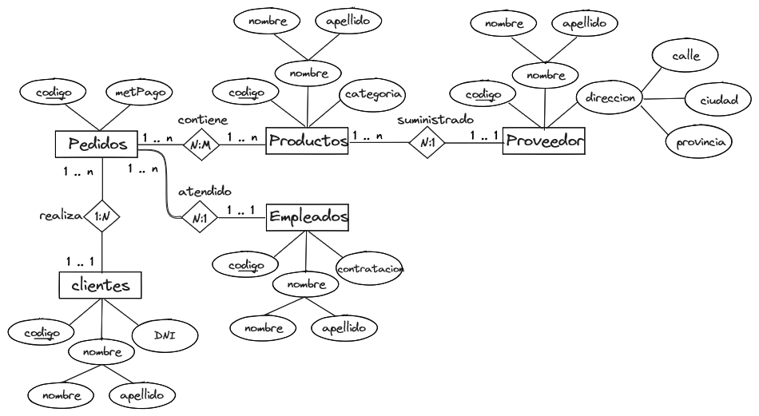
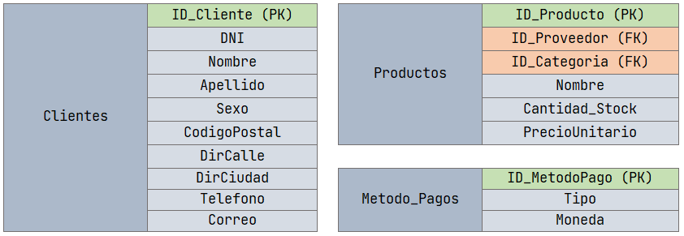
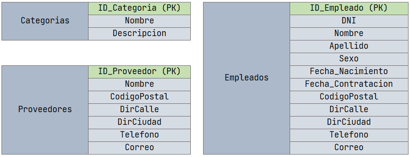
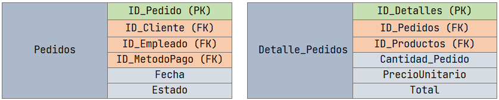
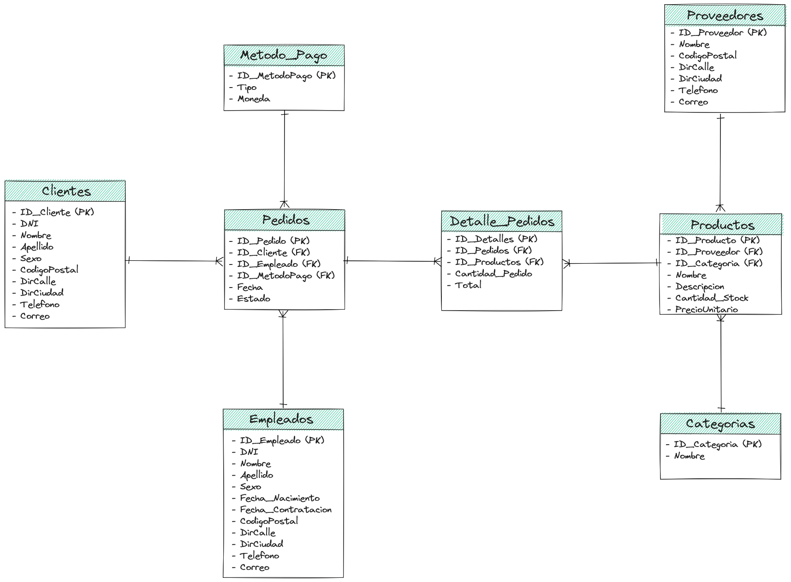

# Sistema Gestor de Ventas

## Tabla de Contenido
1. [Introducción](#1-introducción)
   * 1.1 [Problemática](#11-problemática)
   * 1.2 [Solución](#12-solución)

2. [Modelado de Datos](#2-modelado-de-datos)
   * 2.1 [Análisis de Requerimientos](#21-análisis-de-requerimientos)
   * 2.2 [Modelo Entidad Relación](#22-modelo-entidad-relación)
   * 2.3 [Normalización](#23-normalización)
   * 2.4 [Modelo Relacional](#24-modelo-relacional)

3. [Conclusión](#3-conclusión)

## 0. Antes de Continuar

Antes de avanzar, es crucial entender la estructura del repositorio.

## 1. Introducción

Este documento detalla la propuesta para el desarrollo de un Sistema de Gestión de Ventas respaldado por una base de datos relacional, Microsoft SQL Server 2019, y potenciado por la herramienta de visualización PowerBI.

### 1.1 Problemática

En muchas empresas, especialmente aquellas dedicadas a la venta de productos, la gestión manual de ventas y clientes puede resultar ineficiente y propensa a errores. Los métodos tradicionales de seguimiento en papel o en hojas de cálculo dificultan el acceso y la toma de decisiones informadas. Esta problemática puede manifestarse de diversas maneras:

- **Desorganización de la Información:** Datos dispersos dificultan la búsqueda y recuperación rápida de información.
- **Errores y Fallos en el Seguimiento:** Errores manuales pueden resultar en información incorrecta y desactualizada.
- **Dificultad en el Análisis:** La falta de herramientas adecuadas dificulta la generación de informes precisos.
- **Retrasos en la Toma de Decisiones:** La falta de acceso oportuno a datos relevantes puede dificultar la toma de decisiones informadas.

### 1.2 Solución

La solución propuesta consiste en el diseño e implementación de un Sistema Gestor de Ventas respaldado por una base de datos relacional en SQL Server. Esta solución automatizará y optimizará la gestión de ventas y clientes, permitiendo un seguimiento preciso y en tiempo real de las transacciones, inventarios y análisis de rendimiento. La integración de PowerBI potenciará la visualización de datos, facilitando la generación de informes interactivos y visuales.

## 2. Modelado de datos

### 2.1 Análisis de Requerimientos

En esta sección, exploraremos los requisitos esenciales para el diseño de la base de datos del sistema de gestión de ventas.

#### Clientes

- Registrar información personal de los clientes, como nombre, dirección y contacto.
- Almacenar historial de compras y preferencias para estrategias de marketing personalizadas.

#### Pedidos

- Capturar detalles de los pedidos, incluyendo producto, vendedor, fecha, estado y total.

#### Detalles de Pedidos

- Registrar productos individuales asociados a cada pedido.
- Almacenar cantidad y total de cada producto en el pedido.

#### Métodos de Pago

- Mantener información sobre diferentes métodos de pago aceptados.

#### Productos

- Registrar detalles de productos como nombre, descripción y precio.
- Mantener un registro de inventario para controlar la disponibilidad.

#### Categoría de Productos

- Organizar productos en categorías para facilitar la navegación y búsqueda.

#### Empleados

- Registrar detalles personales y laborales de los empleados.

#### Proveedores

- Registrar detalles de los proveedores, incluyendo información de contacto y productos o servicios suministrados.

### 2.2 Modelo Entidad Relacion

En la siguiente sección, se presentará un modelo E-R desarrollado para el sistema de gestión de ventas, teniendo en cuenta las entidades y relaciones definidas.

A continuacion se describen las relaciones entre las entidades:

- Un Cliente puede realizar varios Pedidos. (1:N)
- Un Pedido pertenece a un Cliente. (N:1)
- Un Pedido contiene muchos Productos (N:M).
- Un Producto puede tener muchos Pedidos (N:M).
- Un Pedido es atendido por un Empleado. (N:1)
- Un Producto o más son suministrados por un Proveedor. (N:1)

### 2.3 Normalización

La normalización es un proceso esencial en el diseño de la base de datos que ayuda a organizar la información de manera eficiente y reducir redundancias. En este contexto, se aplicará la normalización a las tablas del sistema de gestión de ventas para asegurar que estén en conformidad con las formas normales estándar. Este proceso mejora la integridad de los datos y facilita la administración de la base de datos a medida que evoluciona con el tiempo.

**Nota:** Cabe aclarar que, en algunas instancias, se optó por aplicar el proceso de desnormalización. Este enfoque implica la introducción controlada de redundancias, considerando que podría resultar más eficiente y, en ciertos casos, innecesario aplicar todas las formas normales a todas las tablas. La decisión de desnormalizar se tomó cuidadosamente, evaluando el equilibrio entre eficiencia y la necesidad específica de cada tabla en el contexto del sistema de gestión de ventas.

A continuación se presentaran las entidades ya normalizadas:

### 2.4 Modelo Relacional

Para representar el sistema de gestión de ventas a nivel de base de datos, se presenta a continuación un modelo relacional que define las tablas y las relaciones entre ellas. Este modelo ayuda a visualizar cómo las entidades identificadas en el modelo E-R ya Normalizadas se traducen en tablas con columnas y relaciones en una base de datos relacional.

## 3. Data Warehouse
